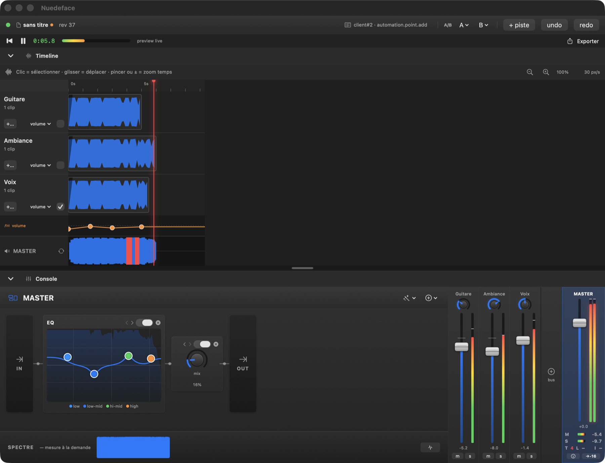
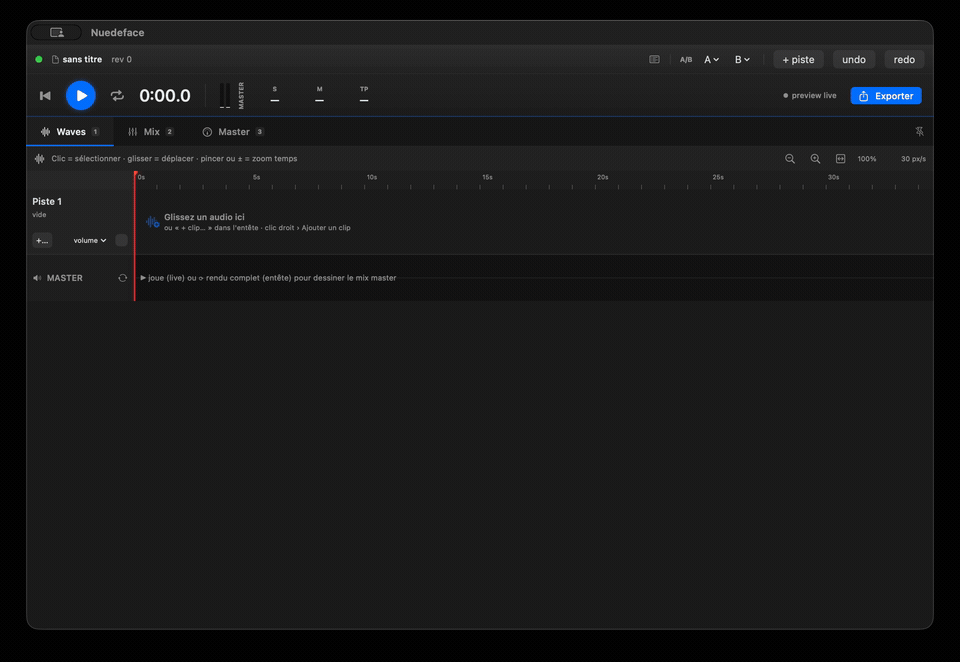

# Nuedeface

[](https://github.com/gwenn-ha-dev/Nuedeface/actions/workflows/ci.yml)
[](./LICENSE)


*🇬🇧 [English](./README.md) · 🇫🇷 Français*

<p align="center"></p>

> Nuendo → « nu en dos » → **« nue de face »**.
> Là où les vieux DAW te tournent le dos (usine à gaz, tout planqué dans des menus), Nuedeface
> montre tout, de face, lisible. Le nom est la thèse.

**Du mix simple, mais de qualité — macOS natif, inspiré de GarageBand, *headless*, piloté par un socket
Unix.** Une seule surface, trois clients : **toi** (l'UI native), une **IA** — *n'importe laquelle*, pas
seulement Claude — et un **script**, tous parlent le même protocole JSON. Chaque effet et traitement est
**Apple natif** (AVAudioEngine + Audio Units), exploité au max — pas de DSP maison. L'IA peut **mixer à ta
place pendant que tu gardes le contrôle** : tu vois chaque geste se poser en direct et tu peux reprendre la
main à tout moment.

<p align="center"></p>

<p align="center"><sub><b>Une IA mixe un podcast, en direct, par le socket</b> — trim de piste · fondus d'entrée/sortie · EQ bande par bande · compression à la main · ducking · chaîne master (EQ · comp · limiteur · −16 LUFS). Chaque geste est un verbe JSON que tu pourrais taper toi-même.</sub></p>

> *État : prototype fonctionnel.* Cœur + API + UI opérationnels et prouvés (bancs de validation mesurés +
> scènes socket sur de vrais fichiers).

---

## Pourquoi

Pour du mix simple, GarageBand fait le job côté moteur mais la présentation est illisible (EQ
incompréhensible, effets planqués). Audacity n'a pas le look mac. **Ce n'est donc pas un projet de DSP,
c'est un projet de clarté (UI) + d'API.** Et comme tout passe par une API auto-décrite, **n'importe quelle
IA peut préparer — ou mixer entièrement — un projet à ta place**, en direct, pendant que tu gardes le contrôle.

**Pensé pour de vrais usages :** préparer un projet avant de reprendre la main, mixer un podcast, nettoyer
et égaliser une voix — des choses simples, bien faites.

---

## Démarrer

```sh
./build.sh                         # swiftc, zéro dépendance (pas de SwiftPM, pas d'install)
./test.sh                          # suite de tests DSP/modèle (offline, déterministe)

open ./Nuedeface.app               # l'UI native (lance un serveur embarqué sur /tmp/nuedeface.sock)
python3 clients/demo_podcast.py    # un script (≈ une IA) monte un mix podcast dans LA MÊME app, en direct

# … ou le serveur seul, headless :
./nuedeface --headless /tmp/nuedeface.sock &
python3 clients/demo_podcast.py
```

> La démo importe une voix + une ambiance (défauts : `assets/voice.wav`, `assets/ambience.mp3`). Aucun
> fichier n'est fourni dans le repo (poids + droits) : dépose les tiens dans `assets/` ou passe des chemins — voir
> [`assets/README.md`](./assets/README.md).

L'**UI est un client du socket comme un autre** : faders, mètres, waveforms et **deltas attribués** se
mettent à jour en direct, que l'action vienne de ta souris ou d'une IA. Un **feed d'activité** (barre de
statut) montre *qui a fait quoi* — tu vois littéralement l'IA travailler.

---

## Piloter (humain, script ou IA — même surface)

Protocole machine-first, **JSON ligne par ligne**. Arbre adressé par **ID stables**, temps en **secondes**
au bord (samples en interne). À la connexion, le serveur t'envoie un `hello` qui pointe vers la découverte.

**Se découvrir sans doc** (le test : brancher n'importe quelle IA à froid et lui dire « mixe cette voix »):
- **`help`** / **`describe`** → tout le jeu de commandes : verbes, **signatures** (args/returns), params avec
  **unité + min/max/défaut**, catalogue des 23 AU Apple, et un **cookbook** (`recipes` + `examples` annotés).
- **`getState`** → le snapshot complet du projet.
- **les deux oreilles** pour *percevoir* l'audio et refermer la boucle muter→mesurer→corriger :
  `analyze` (LUFS/peak/clip), `loudness` (R128 : momentary/short-term/true-peak/LRA), `spectrum` (timbre),
  `meters` (par piste), `detectSilence` (où sont les blancs).

```json
{"cmd":"import","path":"/abs/voix.m4a"}                  → {"ok":true,"assetId":"a1"}
{"cmd":"clip.add","trackId":"t1","asset":"a1","start":0} → {"ok":true,"newId":"c1"}
{"cmd":"set","path":"track/t1/controls/gain","value":0.44}
{"cmd":"clip.setFade","clipId":"c1","fadeIn":0.5,"fadeOut":1.5}
{"cmd":"normalize","target":-16}                          → vise -16 LUFS (garde true-peak)
{"cmd":"analyze"}                                         → {"lufs":-16.0,"peakDBFS":-7.2,"clipping":false}
{"cmd":"export","path":"/abs/out.m4a","format":"m4a"}
```

Chaque mutation diffuse un **delta attribué** (`{"event":"delta","rev":..,"who":"client#2",..}`) à tous les
clients → réplique synchronisée. Les **échecs sont explicites** (`{"ok":false,"error":"…"}`) pour que l'IA
se reprenne seule.

### Les verbes (vue d'ensemble)

| Catégorie | Verbes |
|---|---|
| **Découverte** | `help`/`describe`, `getState` |
| **Audio in/out** | `import`, `export` (wav/m4a AAC natif) |
| **Mesure** | `analyze`, `loudness`, `meters`, `spectrum`, `detectSilence` |
| **Structure** | `track.*`, `bus.*` (sous-mix, routage anti-cycle), `send.*` (taps aux pré/post), `clip.*` (add/move/trim/setFade/split/duplicate/crossfade), `insert.*` (eq·reverb·delay·distortion + **`au`** = n'importe quelle AU Apple) |
| **Réglages** | `set` (gain/pan/mute/solo, params d'inserts), `automation.*` (vol/pan/clip-gain/params, bakée) |
| **Gestes haut niveau** | `normalize`, `match` (loudness\|tone), `duck` (ambiance sous voix), `fx.apply` (recettes) |
| **Transport** (éphémère) | `transport.play/stop/seek`, `subscribe` (télémétrie opt-in) |
| **Projet / essais** | `project.save/load`, `undo`/`redo`, `ab.capture/recall/list` (compare A/B) |

---

## Ce que fait le moteur

- **Mix multipiste** : clips positionnés/tronqués/fondus (galbe linéaire/exp/S), gain/pan/mute/solo, bus de
  sous-mix + sends aux, chaîne d'inserts par piste et par bus.
- **Effets** : EQ 4 bandes, reverb, delay, distortion — **plus l'insert générique `au`** qui ouvre les
  **23 Audio Units effet Apple** (compresseur, limiteur, multibande…), params auto-décrits, zéro code par effet.
- **Automation** bakée au rendu (volume, gain de clip, params d'inserts) + pan piloté par le nœud (même loi
  partout) — audible offline ET en live.
- **Analyse** : LUFS/**true-peak conforme BS.1770 (sur-échantillonnage ×4 polyphase)**/LRA (R128), spectre
  FFT, détection de silences — l'IA *entend* ce qu'elle fait.
- **Preview live** : un `AVAudioEngine` persistant joue le mix ; playhead, VU par piste/bus, **FFT live**,
  **réduction de gain mesurée** et loudness sont streamés en télémétrie (~30 Hz, opt-in).
- **Export** WAV / AAC natif (les traînes d'effets sont rendues jusqu'au silence). Pas d'enregistrement, pas
  de MIDI, pas de plugins tiers (hors scope assumé).

## L'UI

Layout GarageBand (timeline en haut, console en bas, repliables). **Timeline** = clips réels, waveforms,
fades, lanes d'automation, playhead. **Console** = le canal sélectionné en **rack horizontal** (EQ à nœud
draggable avec **spectre live derrière la courbe**, knobs tangibles, GR meters) + section **mix/master**
(mini-faders, VU stéréo, radar loudness). Gestes uniformes (clic droit / long-press = Renommer · Supprimer ·
…), barre de menus macOS native, A/B, sauvegarde consciente (nom de projet + état « modifié »).

---

## Carte du repo

| | |
|---|---|
| `src/` | cœur : `Document` (modèle + log + undo) · `Engine` (rendu offline + LUFS + analyse) · `LiveEngine` (preview + télémétrie) · `Spectrum` · `AudioUnits` · `Recipes` · `Server` (socket) |
| `src/ui/` | UI SwiftUI : `SocketClient` (réplique) · `Console` · `Timeline` · `Widgets` · `Theme` · `ContentView` · `AppHost` |
| `clients/` | `demo_podcast.py` — un mix podcast (voix + ambiance) monté entièrement à la main par le socket ; le script derrière le GIF de démo |
| `tests/` | suite de tests assertés (true-peak, LUFS, fades, automation, silence), lancée par `./test.sh` |
| `proofs/` | bancs de validation Swift autonomes qui ont dé-risqué les points durs (hot-swap, LUFS, fades, reconcile, AU, limiteur, bus, sends, spectre…) |
| `tools/` | utilitaires de dev : `list_audio_units.swift` (énumère les AU Apple), `master.swift` (banc de mastering) |
| `build.sh` · `test.sh` | build swiftc → `./nuedeface` + `Nuedeface.app` · suite de tests |

---

## Contraintes

- **Aucune dépendance externe** : `swiftc` uniquement, pas de SwiftPM, pas d'install.
- **100 % local** : un process, un socket Unix, plusieurs clients (le pattern mpv/mpd/redis). Jamais distant.

---

## Licence

[MIT](./LICENSE) © 2026 gwenn-ha-dev.
